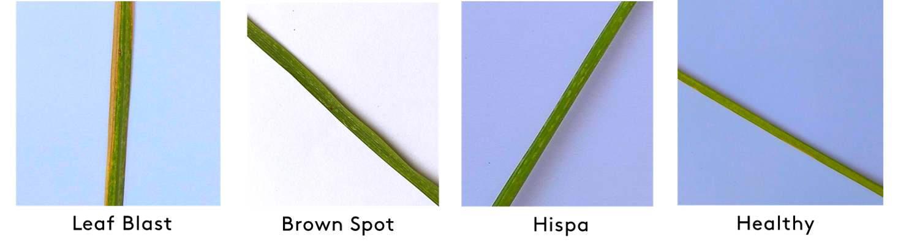
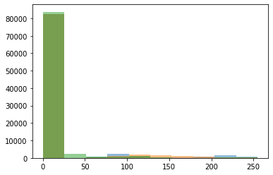
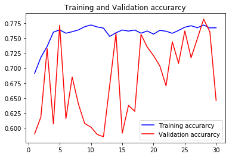
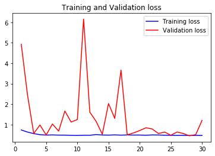

<h1 align='center'><font color="orange">The Rice is Right:</font></h1>
<h1 align='center'>Early Detection of Rice Leaf Disease using Convolutional Neural Networks</h1>

# Highlights

In the Philippines, rice farming industry is very dominant encompassing over 10 million Filipinos. However, these families earn as low as 10 pesos due to the current economy in the industry. Add this to the fact that 37\% of their production are lost due to pests and diseases.

This study aims to help farmers by early detection of disease through rice leaf image processing using convolutional neural networks. The model is trained on the Rice Disease Image Dataset by Huy Minh Do which includes over 3000 rice leaf images. Over 4 categories: Leaf Blast, Brown Spot, Hispa, and Healthy; the model performs well at 78.2\% accuracy. We also looked at how it performs on classifying a healthy rice leaf and found that the model performed even better at 92.2\%. Furthermore, we saw that the model is capable even for cases where the symptoms of the disease are still very small. This model gives farmers ample time to potentially save their crops, have better yield, and save cost from fertilizers and pesticides.

## Data

The data used for this project is [Rice Diseases Image Dataset](https://www.kaggle.com/minhhuy2810/rice-diseases-image-dataset/version/1?fbclid=IwAR3QwbQzFpHLe_KCelIbrrMB4kwaBfhzJhrcqLwX7DEOJmLfkI4ZRF2le4U) compiled by Huy Minh Do and uploaded in Kaggle. This consists of 3355 images of isolated rice leaves with four classifications: Healthy (1488) or afflicted with one of the diseases: Hispa (565), Brown Spot (523), or Leaf Blast (779). The image sizes range from 734 by 734 pixels to 3120 by 3120 pixels. Sample images of the dataset for each classification is shown in Figure 1.


<div align='center'>Figure 1. Sample images of rice leaves per classification: Leaf Blast, Brown Spot, Hispa, and Healthy.</div>

## Data Pre-processing

Before any modeling or classification is performed on the images, several image pre-processing steps must be performed first.

### Reshape

To account for any limitations that may arise due to camera specifications, all images are reshaped to 300 by 300 pixels, regardless of initial shape. In doing so, the model that will be trained in the succeeding parts will be applicable to even low-quality images. We use PIL for this.


```python
from PIL import Image
import glob
```


```python
files = glob.glob('D://Users/Public/Documents/MSDS/Data/rice-diseases-image-dataset/LabelledRice/Labelled/*/*')
```


```python
files_reshape = list(map(lambda x: x.replace('/Labelled\\', '/Resized\\'), files))
```


```python
basewidth = 300
for file, file_save in zip(files, files_reshape):
    img = Image.open(file)
    wpercent = (basewidth/float(img.size[0]))
    hsize = int((float(img.size[1])*float(wpercent)))
    img = img.resize((basewidth,hsize), Image.ANTIALIAS)
    img.save(file_save)

```

 To do this, a mask is created using the following steps:

### Background removal
After reshaping, the foreground of the image, i.e. the actual leaf, must be separated from the background to reduce noise and data leakage, which would then lead to easier model training. With this, we need to do automated background removal such that an actual photo not taken in an isolated environment can be classified properly by our model.

These are the steps taken to remove the background per image:

1. We first perform thresholding according to the RGB values. We want the green pixels and the area around it so we filter by taking out the pixels that have too high red and blue values.

        1a. We start with 220 threshold (out of 255) and continuously reduce this threshold if the resulting mask image is too big (i.e. not much of the image has been filtered).

2. From the resulting mask, we perform morphological techniques like opening so that the pixels in-between the green leaf pixels will be included into the mask (i.e. the brown spots which will most likely be filtered out will be included using the morphological technique). For this, we use a circular structuring element of radius 13px.

3. We perform erosion to increase the area of the mask in order for the filter to include the immediate surrounding pixels. Then a final closing operation was done to remove the isolated dots.

4. From the blobs formed, we select the largest one and use that as the mask for our actual image.

*erosion and opening was used and not dilation and closing since the foreground and background are reversed in the mask (the actual area we want to use has values of False and the backgroudn we want to remove has values of True)


```python
from skimage.morphology import binary_closing, binary_opening, erosion
```


```python
files_bgremoved = list(map(lambda x: x.replace('/Labelled\\', '/BGRemoved\\'), files))
```


```python
selem = np.zeros((25, 25))

ci,cj=12, 12
cr=13

# Create index arrays to z
I,J=np.meshgrid(np.arange(selem.shape[0]),np.arange(selem.shape[1]))

# calculate distance of all points to centre
dist=np.sqrt((I-ci)**2+(J-cj)**2)

# Assign value of 1 to those points where dist<cr:
selem[np.where(dist<=cr)]=1
```


```python
%matplotlib inline
import numpy as np
from scipy import ndimage

# fig, ax = plt.subplots(20,2, figsize=(10,80))
idx = 0
for file, file_save in zip(files, files_bgremoved):
    bg_frac = 0
    thres = 220
    img = Image.open(file)
    im_arr = np.array(img)
#     ax[idx, 0].imshow(im_arr)
    R = im_arr[:, :, 0]
    G = im_arr[:, :, 1]
    B = im_arr[:, :, 2]
    while bg_frac < 0.6:
        bg_mask = ((R>thres) | (B>thres))# & (G < 100)
        bg_frac = bg_mask.sum()/len(bg_mask.flatten())
        thres -= 5
    # we use opening first since our mask is reversed (the foreground and background are reversed here)
    bg_mask = binary_closing(erosion(binary_opening(bg_mask, selem), np.ones((3, 3))), np.ones((5,5)))

    #Get biggest blob
    label, num_label = ndimage.label(~bg_mask)
    size = np.bincount(label.ravel())
    biggest_label = size[1:].argmax() + 1
    bg_mask = label == biggest_label

    im_arr[~bg_mask, 0] = 255
    im_arr[~bg_mask, 1] = 255
    im_arr[~bg_mask, 2] = 255

    img = Image.fromarray(im_arr)
    img.save(file_save)
    idx+=1
```


```python
%matplotlib inline
import matplotlib.pyplot as plt
plt.hist(R.flatten(), alpha=0.5)
plt.hist(G.flatten(), alpha=0.5)
plt.hist(B.flatten(), alpha=0.5)

```


    (array([83779.,  2307.,   865.,   781.,  1153.,   383.,   118.,    89.,
              148.,   377.]),
     array([  0. ,  25.5,  51. ,  76.5, 102. , 127.5, 153. , 178.5, 204. ,
            229.5, 255. ]),
     <a list of 10 Patch objects>)





### Data Augmentation

To account for different environments upon taking the picture, e.g. rotated images, shifted objects, zoomed in pictures, image augmentation is performed. The augmented images will be transformed versions of the dataset by randomly rotating the image up to 30$^\circ$, shifting the image vertically or horizontally up to 15% of the image length, shearing the image up to 20$^\circ$, and zooming in the image 0.8x to 1.2x.


```python
import os
import numpy as np
from tensorflow.keras.preprocessing.image import ImageDataGenerator
from tensorflow.keras import models
from tensorflow.keras import layers
from tensorflow.keras import optimizers
import matplotlib.pyplot as plt
%matplotlib inline

base_dir = ('D://Users/Public/Documents/MSDS/Data/rice-diseases-image-dataset/LabelledRice/BGRemoved')
os.makedirs(base_dir, exist_ok=True)
```


```python
datagen = ImageDataGenerator(
    rotation_range=30, width_shift_range=0.15,
    height_shift_range=0.15, shear_range=0.15,
    zoom_range=0.2,horizontal_flip=True,
    fill_mode="nearest", validation_split=0.3)
batch_size = 32

train_generator = datagen.flow_from_directory(
    base_dir,
    target_size=(224, 224),
    batch_size=batch_size,
    class_mode='categorical',
    subset='training')

val_generator = datagen.flow_from_directory(
    base_dir,
    target_size=(224, 224),
    batch_size=batch_size,
    class_mode='categorical',
    subset='validation')
```

    Found 2319 images belonging to 4 classes.
    Found 991 images belonging to 4 classes.


## Modeling

For the modeling, we used different pre-trained models and one manually made model to classify the images. Six architectures were used for this project:

1. VGG16 base for feature extraction and 3-dense layers for classification.
2. VGG16 base with only the first 3 blocks frozen and 3-dense layers
3. VGG19 base and 3-dense layers
4. XCeption base and 3-dense layers
5. ResNet base and 3-dense layers
6. 5 convolutional layers and 2-dense layers

### VGG16


```python
from tensorflow.keras.callbacks import ModelCheckpoint, ReduceLROnPlateau

checkpoint = ModelCheckpoint('VGG16.h5', verbose=1, monitor='val_accuracy', save_best_only=True, mode='auto')  
```


```python
datagen = ImageDataGenerator(
    rotation_range=30, width_shift_range=0.15,
    height_shift_range=0.15, shear_range=0.15,
    zoom_range=0.2,horizontal_flip=True,
    fill_mode="nearest")
# datagen = ImageDataGenerator(rescale=1./255)

def extract_features(trainorval, sample_count):
    features = np.zeros(shape=(sample_count, 7, 7, 512))
    labels = np.zeros(shape=(sample_count, 4))
    if trainorval=="training":
        generator = train_generator
    else:
        generator = val_generator
    i = 0
    for inputs_batch, labels_batch in generator:
        features_batch = conv_base.predict(preprocess_input(inputs_batch))
        try:
            features[i * batch_size : (i + 1) * batch_size] = features_batch
            labels[i * batch_size : (i + 1) * batch_size] = labels_batch
        except ValueError:
            break
        i += 1
        if i * batch_size >= sample_count:
            break
    return features, labels

```


```python
from tensorflow.keras.applications.vgg16 import VGG16, preprocess_input

conv_base = VGG16(weights='imagenet',
                  include_top=False,
                  input_shape=(224, 224, 3))
```

    WARNING:tensorflow:From C:\Users\Justin\Anaconda3\envs\tf-gpu\lib\site-packages\tensorflow\python\ops\init_ops.py:1251: calling VarianceScaling.__init__ (from tensorflow.python.ops.init_ops) with dtype is deprecated and will be removed in a future version.
    Instructions for updating:
    Call initializer instance with the dtype argument instead of passing it to the constructor


```python
conv_base.trainable = True
for layer in conv_base.layers:
    layer.trainable = True

```


```python
train_features, train_labels = extract_features('training', 2319)
validation_features, validation_labels = extract_features('validation', 991)

train_features = np.reshape(train_features, (2319, 7 * 7 * 512))
validation_features = np.reshape(validation_features, (991, 7 * 7 * 512))
```


```python
model = models.Sequential()
model.add(layers.Dense(256, activation='relu', input_dim=7 * 7 * 512))
model.add(layers.Dropout(0.2))
model.add(layers.Dense(128, activation='relu'))
model.add(layers.Dropout(0.2))  #Removing 50% of the weights!
model.add(layers.Dense(4, activation='softmax'))
```


```python
from tensorflow.keras.optimizers import Adam

INIT_LR = 1e-1
EPOCHS = 30

opt = Adam(lr=INIT_LR, decay=INIT_LR / EPOCHS)
model.compile(loss="binary_crossentropy", optimizer=opt, metrics=["accuracy"])
```


```python
from tensorflow.keras.models import Sequential
from tensorflow.keras.layers import Dense
# from tensorflow.keras.utils.vis_utils import plot_model
from tensorflow.keras.utils import plot_model
import os
os.environ["PATH"] += os.pathsep + 'C:\\Users\\1000246125\\AppData\\Local\\Continuum\\anaconda3\\Library\\bin'
model = Sequential()
model.add(Dense(2, input_dim=1, activation='relu'))
model.add(Dense(1, activation='sigmoid'))
plot_model(model, to_file='model_plot.png', show_shapes=True, show_layer_names=True)
```

    Failed to import pydot. You must install pydot and graphviz for `pydotprint` to work.


```python
from tensorflow.keras.optimizers import Adam

INIT_LR = 1e-1
EPOCHS = 30

opt = Adam(lr=INIT_LR, decay=INIT_LR / EPOCHS)

model.compile(loss="binary_crossentropy", optimizer=opt, metrics=["accuracy"])

from keras.callbacks import ModelCheckpoint

checkpoint = ModelCheckpoint('VGG16.h5', verbose=1, monitor='val_acc', save_best_only=True, mode='auto')

history = model.fit(train_features, train_labels,
                    epochs=30,
                    batch_size=batch_size,
                    validation_data=(validation_features, validation_labels),
                    callbacks=[checkpoint])
```

    Train on 2319 samples, validate on 991 samples
    WARNING:tensorflow:From C:\Users\Justin\Anaconda3\envs\tf-gpu\lib\site-packages\tensorflow\python\ops\math_grad.py:1250: add_dispatch_support.<locals>.wrapper (from tensorflow.python.ops.array_ops) is deprecated and will be removed in a future version.
    Instructions for updating:
    Use tf.where in 2.0, which has the same broadcast rule as np.where


    Using TensorFlow backend.


    Epoch 1/30
    2272/2319 [============================>.] - ETA: 0s - loss: 6.3477 - acc: 0.5844
    Epoch 00001: val_acc improved from -inf to 0.58426, saving model to VGG16.h5
    2319/2319 [==============================] - 3s 1ms/sample - loss: 6.3451 - acc: 0.5846 - val_loss: 6.3937 - val_acc: 0.5843
    Epoch 2/30
    2272/2319 [============================>.] - ETA: 0s - loss: 6.3831 - acc: 0.5849
    Epoch 00002: val_acc did not improve from 0.58426
    2319/2319 [==============================] - 3s 1ms/sample - loss: 6.3964 - acc: 0.5841 - val_loss: 6.3937 - val_acc: 0.5843
    Epoch 3/30
    2272/2319 [============================>.] - ETA: 0s - loss: 6.3933 - acc: 0.5843
    Epoch 00003: val_acc did not improve from 0.58426
    2319/2319 [==============================] - 3s 1ms/sample - loss: 6.3964 - acc: 0.5841 - val_loss: 6.3937 - val_acc: 0.5843
    Epoch 4/30
    2272/2319 [============================>.] - ETA: 0s - loss: 6.3967 - acc: 0.5841
    Epoch 00004: val_acc did not improve from 0.58426
    2319/2319 [==============================] - 3s 1ms/sample - loss: 6.3964 - acc: 0.5841 - val_loss: 6.3937 - val_acc: 0.5843
    Epoch 5/30
    2272/2319 [============================>.] - ETA: 0s - loss: 6.3933 - acc: 0.5843
    Epoch 00005: val_acc did not improve from 0.58426
    2319/2319 [==============================] - 3s 1ms/sample - loss: 6.3964 - acc: 0.5841 - val_loss: 6.3937 - val_acc: 0.5843
    Epoch 6/30
    2304/2319 [============================>.] - ETA: 0s - loss: 6.3979 - acc: 0.5840
    Epoch 00006: val_acc did not improve from 0.58426
    2319/2319 [==============================] - 3s 1ms/sample - loss: 6.3964 - acc: 0.5841 - val_loss: 6.3937 - val_acc: 0.5843
    Epoch 7/30
    2272/2319 [============================>.] - ETA: 0s - loss: 6.4001 - acc: 0.5838
    Epoch 00007: val_acc did not improve from 0.58426
    2319/2319 [==============================] - 3s 1ms/sample - loss: 6.3964 - acc: 0.5841 - val_loss: 6.3937 - val_acc: 0.5843
    Epoch 8/30
    2304/2319 [============================>.] - ETA: 0s - loss: 6.4013 - acc: 0.5838
    Epoch 00008: val_acc did not improve from 0.58426
    2319/2319 [==============================] - 3s 1ms/sample - loss: 6.3964 - acc: 0.5841 - val_loss: 6.3937 - val_acc: 0.5843
    Epoch 9/30
    2272/2319 [============================>.] - ETA: 0s - loss: 6.4102 - acc: 0.5832
    Epoch 00009: val_acc did not improve from 0.58426
    2319/2319 [==============================] - 3s 1ms/sample - loss: 6.3964 - acc: 0.5841 - val_loss: 6.3937 - val_acc: 0.5843
    Epoch 10/30
    2304/2319 [============================>.] - ETA: 0s - loss: 6.3913 - acc: 0.5844
    Epoch 00010: val_acc did not improve from 0.58426
    2319/2319 [==============================] - 3s 1ms/sample - loss: 6.3964 - acc: 0.5841 - val_loss: 6.3937 - val_acc: 0.5843
    Epoch 11/30
    2272/2319 [============================>.] - ETA: 0s - loss: 6.4034 - acc: 0.5836
    Epoch 00011: val_acc did not improve from 0.58426
    2319/2319 [==============================] - 3s 1ms/sample - loss: 6.3964 - acc: 0.5841 - val_loss: 6.3937 - val_acc: 0.5843
    Epoch 12/30
    2272/2319 [============================>.] - ETA: 0s - loss: 6.4034 - acc: 0.5836
    Epoch 00012: val_acc did not improve from 0.58426
    2319/2319 [==============================] - 3s 1ms/sample - loss: 6.3964 - acc: 0.5841 - val_loss: 6.3937 - val_acc: 0.5843
    Epoch 13/30
    2304/2319 [============================>.] - ETA: 0s - loss: 6.3979 - acc: 0.5840
    Epoch 00013: val_acc did not improve from 0.58426
    2319/2319 [==============================] - 3s 1ms/sample - loss: 6.3964 - acc: 0.5841 - val_loss: 6.3937 - val_acc: 0.5843
    Epoch 14/30
    2304/2319 [============================>.] - ETA: 0s - loss: 6.3946 - acc: 0.5842
    Epoch 00014: val_acc did not improve from 0.58426
    2319/2319 [==============================] - 3s 1ms/sample - loss: 6.3964 - acc: 0.5841 - val_loss: 6.3937 - val_acc: 0.5843
    Epoch 15/30
    2304/2319 [============================>.] - ETA: 0s - loss: 6.4013 - acc: 0.5838
    Epoch 00015: val_acc did not improve from 0.58426
    2319/2319 [==============================] - 3s 1ms/sample - loss: 6.3964 - acc: 0.5841 - val_loss: 6.3937 - val_acc: 0.5843
    Epoch 16/30
    2272/2319 [============================>.] - ETA: 0s - loss: 6.3899 - acc: 0.5845
    Epoch 00016: val_acc did not improve from 0.58426
    2319/2319 [==============================] - 3s 1ms/sample - loss: 6.3964 - acc: 0.5841 - val_loss: 6.3937 - val_acc: 0.5843
    Epoch 17/30
    2272/2319 [============================>.] - ETA: 0s - loss: 6.3967 - acc: 0.5841
    Epoch 00017: val_acc did not improve from 0.58426
    2319/2319 [==============================] - 3s 1ms/sample - loss: 6.3964 - acc: 0.5841 - val_loss: 6.3937 - val_acc: 0.5843
    Epoch 18/30
    2272/2319 [============================>.] - ETA: 0s - loss: 6.4068 - acc: 0.5834- ETA: 1s - loss: 6.58
    Epoch 00018: val_acc did not improve from 0.58426
    2319/2319 [==============================] - 2s 1ms/sample - loss: 6.3964 - acc: 0.5841 - val_loss: 6.3937 - val_acc: 0.5843
    Epoch 19/30
    2272/2319 [============================>.] - ETA: 0s - loss: 6.4001 - acc: 0.5838
    Epoch 00019: val_acc did not improve from 0.58426
    2319/2319 [==============================] - 3s 1ms/sample - loss: 6.3964 - acc: 0.5841 - val_loss: 6.3937 - val_acc: 0.5843
    Epoch 20/30
    2272/2319 [============================>.] - ETA: 0s - loss: 6.4136 - acc: 0.5830
    Epoch 00020: val_acc did not improve from 0.58426
    2319/2319 [==============================] - 3s 1ms/sample - loss: 6.3964 - acc: 0.5841 - val_loss: 6.3937 - val_acc: 0.5843
    Epoch 21/30
    2272/2319 [============================>.] - ETA: 0s - loss: 6.4034 - acc: 0.5836
    Epoch 00021: val_acc did not improve from 0.58426
    2319/2319 [==============================] - 3s 1ms/sample - loss: 6.3964 - acc: 0.5841 - val_loss: 6.3937 - val_acc: 0.5843
    Epoch 22/30
    2272/2319 [============================>.] - ETA: 0s - loss: 6.4001 - acc: 0.5838
    Epoch 00022: val_acc did not improve from 0.58426
    2319/2319 [==============================] - 3s 1ms/sample - loss: 6.3964 - acc: 0.5841 - val_loss: 6.3937 - val_acc: 0.5843
    Epoch 23/30
    2272/2319 [============================>.] - ETA: 0s - loss: 6.3899 - acc: 0.5845
    Epoch 00023: val_acc did not improve from 0.58426
    2319/2319 [==============================] - 3s 1ms/sample - loss: 6.3964 - acc: 0.5841 - val_loss: 6.3937 - val_acc: 0.5843
    Epoch 24/30
    2272/2319 [============================>.] - ETA: 0s - loss: 6.4034 - acc: 0.5836
    Epoch 00024: val_acc did not improve from 0.58426
    2319/2319 [==============================] - 3s 1ms/sample - loss: 6.3964 - acc: 0.5841 - val_loss: 6.3937 - val_acc: 0.5843
    Epoch 25/30
    2272/2319 [============================>.] - ETA: 0s - loss: 6.3933 - acc: 0.5843
    Epoch 00025: val_acc did not improve from 0.58426
    2319/2319 [==============================] - 3s 1ms/sample - loss: 6.3964 - acc: 0.5841 - val_loss: 6.3937 - val_acc: 0.5843
    Epoch 26/30
    2272/2319 [============================>.] - ETA: 0s - loss: 6.3933 - acc: 0.5843
    Epoch 00026: val_acc did not improve from 0.58426
    2319/2319 [==============================] - 3s 1ms/sample - loss: 6.3964 - acc: 0.5841 - val_loss: 6.3937 - val_acc: 0.5843
    Epoch 27/30
    2272/2319 [============================>.] - ETA: 0s - loss: 6.3933 - acc: 0.5843
    Epoch 00027: val_acc did not improve from 0.58426
    2319/2319 [==============================] - 3s 1ms/sample - loss: 6.3964 - acc: 0.5841 - val_loss: 6.3937 - val_acc: 0.5843
    Epoch 28/30
    2272/2319 [============================>.] - ETA: 0s - loss: 6.3899 - acc: 0.5845
    Epoch 00028: val_acc did not improve from 0.58426
    2319/2319 [==============================] - 3s 1ms/sample - loss: 6.3964 - acc: 0.5841 - val_loss: 6.3937 - val_acc: 0.5843
    Epoch 29/30
    2272/2319 [============================>.] - ETA: 0s - loss: 6.4001 - acc: 0.5838
    Epoch 00029: val_acc did not improve from 0.58426
    2319/2319 [==============================] - 3s 1ms/sample - loss: 6.3964 - acc: 0.5841 - val_loss: 6.3937 - val_acc: 0.5843
    Epoch 30/30
    2272/2319 [============================>.] - ETA: 0s - loss: 6.4034 - acc: 0.5836
    Epoch 00030: val_acc did not improve from 0.58426
    2319/2319 [==============================] - 3s 1ms/sample - loss: 6.3964 - acc: 0.5841 - val_loss: 6.3937 - val_acc: 0.5843


### VGG16 (Frozen first 3)


```python
datagen = ImageDataGenerator(
    rotation_range=30, width_shift_range=0.15,
    height_shift_range=0.15, shear_range=0.15,
    zoom_range=0.2,horizontal_flip=True,
    fill_mode="nearest", validation_split=0.3)
batch_size = 32

train_generator = datagen.flow_from_directory(
    base_dir,
    target_size=(224, 224),
    batch_size=batch_size,
    class_mode='categorical',
    subset='training')

val_generator = datagen.flow_from_directory(
    base_dir,
    target_size=(224, 224),
    batch_size=batch_size,
    class_mode='categorical',
    subset='validation')
```

    Found 2319 images belonging to 4 classes.
    Found 991 images belonging to 4 classes.


```python
conv_base.trainable = True

set_trainable = False
for layer in conv_base.layers:
    if layer.name == 'block4_conv1':
        set_trainable = True
    if set_trainable:
        layer.trainable = True
    else:
        layer.trainable = False
```


```python
model = models.Sequential()
model.add(conv_base)
model.add(layers.Flatten())
model.add(layers.Dense(256, activation='relu', input_dim=7 * 7 * 512))
# model.add(layers.Dropout(0.2))
model.add(layers.Dense(128, activation='relu'))
# model.add(layers.Dropout(0.2))  #Removing 50% of the weights!
model.add(layers.Dense(4, activation='softmax'))
```


```python
from tensorflow.keras.optimizers import Adam

INIT_LR = 1e-3
EPOCHS = 30

opt = Adam(lr=INIT_LR, decay=INIT_LR / EPOCHS)

model.compile(loss="binary_crossentropy", optimizer=opt, metrics=["accuracy"])

from keras.callbacks import ModelCheckpoint

checkpoint = ModelCheckpoint('VGG16_frozen3.h5', verbose=1, monitor='val_acc', save_best_only=True, mode='auto')

history = model.fit_generator(train_generator,
                    epochs=30,
                    steps_per_epoch=2319 // batch_size,
                    validation_data=val_generator,
                    callbacks=[checkpoint])
```

    Epoch 1/30
    71/72 [============================>.] - ETA: 6s - loss: 4.5213 - acc: 0.7051
    Epoch 00001: val_acc improved from -inf to 0.72200, saving model to VGG16_frozen4.h5
    72/72 [==============================] - 550s 8s/step - loss: 4.5388 - acc: 0.7040 - val_loss: 4.2754 - val_acc: 0.7220
    Epoch 2/30
    71/72 [============================>.] - ETA: 5s - loss: 4.2951 - acc: 0.7206
    Epoch 00002: val_acc did not improve from 0.72200
    72/72 [==============================] - 535s 7s/step - loss: 4.2922 - acc: 0.7208 - val_loss: 4.2761 - val_acc: 0.7220
    Epoch 3/30
    71/72 [============================>.] - ETA: 5s - loss: 4.2723 - acc: 0.7226
    Epoch 00003: val_acc did not improve from 0.72200
    72/72 [==============================] - 535s 7s/step - loss: 4.2596 - acc: 0.7234 - val_loss: 4.2754 - val_acc: 0.7220
    Epoch 4/30
    71/72 [============================>.] - ETA: 5s - loss: 4.3019 - acc: 0.7202
    Epoch 00004: val_acc did not improve from 0.72200
    72/72 [==============================] - 537s 7s/step - loss: 4.2922 - acc: 0.7208 - val_loss: 4.2754 - val_acc: 0.7220
    Epoch 5/30
    71/72 [============================>.] - ETA: 5s - loss: 4.2613 - acc: 0.7228
    Epoch 00005: val_acc did not improve from 0.72200
    72/72 [==============================] - 537s 7s/step - loss: 4.2689 - acc: 0.7223 - val_loss: 4.2751 - val_acc: 0.7220
    Epoch 6/30
    71/72 [============================>.] - ETA: 5s - loss: 4.3082 - acc: 0.7195
    Epoch 00006: val_acc did not improve from 0.72200
    72/72 [==============================] - 537s 7s/step - loss: 4.3085 - acc: 0.7195 - val_loss: 4.2749 - val_acc: 0.7220
    Epoch 7/30
    71/72 [============================>.] - ETA: 6s - loss: 4.2667 - acc: 0.7217
    Epoch 00007: val_acc did not improve from 0.72200
    72/72 [==============================] - 551s 8s/step - loss: 4.2477 - acc: 0.7230 - val_loss: 4.2754 - val_acc: 0.7220
    Epoch 8/30
    71/72 [============================>.] - ETA: 6s - loss: 4.2644 - acc: 0.7227
    Epoch 00008: val_acc did not improve from 0.72200
    72/72 [==============================] - 540s 7s/step - loss: 4.2720 - acc: 0.7222 - val_loss: 4.2749 - val_acc: 0.7220
    Epoch 9/30
    71/72 [============================>.] - ETA: 5s - loss: 4.3051 - acc: 0.7196
    Epoch 00009: val_acc did not improve from 0.72200
    72/72 [==============================] - 533s 7s/step - loss: 4.3054 - acc: 0.7196 - val_loss: 4.2741 - val_acc: 0.7220
    Epoch 10/30
    71/72 [============================>.] - ETA: 5s - loss: 4.2177 - acc: 0.7259
    Epoch 00010: val_acc did not improve from 0.72200
    72/72 [==============================] - 535s 7s/step - loss: 4.2325 - acc: 0.7250 - val_loss: 4.2746 - val_acc: 0.7220
    Epoch 11/30
    71/72 [============================>.] - ETA: 5s - loss: 4.2791 - acc: 0.7222
    Epoch 00011: val_acc did not improve from 0.72200
    72/72 [==============================] - 536s 7s/step - loss: 4.2797 - acc: 0.7221 - val_loss: 4.2749 - val_acc: 0.7220
    Epoch 12/30
    71/72 [============================>.] - ETA: 5s - loss: 4.3084 - acc: 0.7199
    Epoch 00012: val_acc did not improve from 0.72200
    72/72 [==============================] - 538s 7s/step - loss: 4.3120 - acc: 0.7196 - val_loss: 4.2756 - val_acc: 0.7220
    Epoch 13/30
    71/72 [============================>.] - ETA: 5s - loss: 4.2509 - acc: 0.7232
    Epoch 00013: val_acc did not improve from 0.72200
    72/72 [==============================] - 537s 7s/step - loss: 4.2487 - acc: 0.7233 - val_loss: 4.2741 - val_acc: 0.7220
    Epoch 14/30
    71/72 [============================>.] - ETA: 5s - loss: 4.2782 - acc: 0.7217
    Epoch 00014: val_acc did not improve from 0.72200
    72/72 [==============================] - 542s 8s/step - loss: 4.2789 - acc: 0.7217 - val_loss: 4.2761 - val_acc: 0.7220
    Epoch 15/30
    71/72 [============================>.] - ETA: 5s - loss: 4.3134 - acc: 0.7202
    Epoch 00015: val_acc did not improve from 0.72200
    72/72 [==============================] - 535s 7s/step - loss: 4.3001 - acc: 0.7210 - val_loss: 4.2756 - val_acc: 0.7220
    Epoch 16/30
    71/72 [============================>.] - ETA: 5s - loss: 4.2850 - acc: 0.7213
    Epoch 00016: val_acc did not improve from 0.72200
    72/72 [==============================] - 535s 7s/step - loss: 4.2755 - acc: 0.7219 - val_loss: 4.2759 - val_acc: 0.7220
    Epoch 17/30
    71/72 [============================>.] - ETA: 6s - loss: 4.2543 - acc: 0.7234
    Epoch 00017: val_acc did not improve from 0.72200
    72/72 [==============================] - 539s 7s/step - loss: 4.2620 - acc: 0.7229 - val_loss: 4.2744 - val_acc: 0.7220
    Epoch 18/30
    71/72 [============================>.] - ETA: 5s - loss: 4.3141 - acc: 0.7203
    Epoch 00018: val_acc did not improve from 0.72200
    72/72 [==============================] - 532s 7s/step - loss: 4.3107 - acc: 0.7205 - val_loss: 4.2739 - val_acc: 0.7220
    Epoch 19/30
    71/72 [============================>.] - ETA: 5s - loss: 4.2566 - acc: 0.7224
    Epoch 00019: val_acc did not improve from 0.72200
    72/72 [==============================] - 535s 7s/step - loss: 4.2510 - acc: 0.7228 - val_loss: 4.2749 - val_acc: 0.7220
    Epoch 20/30
    71/72 [============================>.] - ETA: 5s - loss: 4.2227 - acc: 0.7246
    Epoch 00020: val_acc did not improve from 0.72200
    72/72 [==============================] - 538s 7s/step - loss: 4.2210 - acc: 0.7247 - val_loss: 4.2751 - val_acc: 0.7220
    Epoch 21/30
    71/72 [============================>.] - ETA: 5s - loss: 4.3121 - acc: 0.7195
    Epoch 00021: val_acc did not improve from 0.72200
    72/72 [==============================] - 536s 7s/step - loss: 4.3056 - acc: 0.7199 - val_loss: 4.2761 - val_acc: 0.7220
    Epoch 22/30
    71/72 [============================>.] - ETA: 5s - loss: 4.3116 - acc: 0.7193
    Epoch 00022: val_acc did not improve from 0.72200
    72/72 [==============================] - 537s 7s/step - loss: 4.3085 - acc: 0.7195 - val_loss: 4.2741 - val_acc: 0.7220
    Epoch 23/30
    71/72 [============================>.] - ETA: 5s - loss: 4.3048 - acc: 0.7197
    Epoch 00023: val_acc did not improve from 0.72200
    72/72 [==============================] - 535s 7s/step - loss: 4.2985 - acc: 0.7202 - val_loss: 4.2764 - val_acc: 0.7220
    Epoch 24/30
    71/72 [============================>.] - ETA: 6s - loss: 4.1798 - acc: 0.7282
    Epoch 00024: val_acc did not improve from 0.72200
    72/72 [==============================] - 540s 7s/step - loss: 4.1752 - acc: 0.7285 - val_loss: 4.2754 - val_acc: 0.7220
    Epoch 25/30
    71/72 [============================>.] - ETA: 5s - loss: 4.3330 - acc: 0.7183
    Epoch 00025: val_acc did not improve from 0.72200
    72/72 [==============================] - 532s 7s/step - loss: 4.3263 - acc: 0.7187 - val_loss: 4.2751 - val_acc: 0.7220
    Epoch 26/30
    71/72 [============================>.] - ETA: 5s - loss: 4.3186 - acc: 0.7192
    Epoch 00026: val_acc did not improve from 0.72200
    72/72 [==============================] - 537s 7s/step - loss: 4.3187 - acc: 0.7192 - val_loss: 4.2759 - val_acc: 0.7220
    Epoch 27/30
    71/72 [============================>.] - ETA: 5s - loss: 4.2836 - acc: 0.7223
    Epoch 00027: val_acc did not improve from 0.72200
    72/72 [==============================] - 537s 7s/step - loss: 4.2974 - acc: 0.7214 - val_loss: 4.2751 - val_acc: 0.7220
    Epoch 28/30
    71/72 [============================>.] - ETA: 5s - loss: 4.2105 - acc: 0.7262
    Epoch 00028: val_acc did not improve from 0.72200
    72/72 [==============================] - 536s 7s/step - loss: 4.2055 - acc: 0.7265 - val_loss: 4.2754 - val_acc: 0.7220
    Epoch 29/30
    71/72 [============================>.] - ETA: 5s - loss: 4.2613 - acc: 0.7228
    Epoch 00029: val_acc did not improve from 0.72200
    72/72 [==============================] - 536s 7s/step - loss: 4.2655 - acc: 0.7226 - val_loss: 4.2756 - val_acc: 0.7220
    Epoch 30/30
    71/72 [============================>.] - ETA: 5s - loss: 4.3024 - acc: 0.7204
    Epoch 00030: val_acc did not improve from 0.72200
    72/72 [==============================] - 535s 7s/step - loss: 4.3060 - acc: 0.7202 - val_loss: 4.2759 - val_acc: 0.7220


### VGG19


```python
datagen = ImageDataGenerator(
    rotation_range=30, width_shift_range=0.15,
    height_shift_range=0.15, shear_range=0.15,
    zoom_range=0.2,horizontal_flip=True,
    fill_mode="nearest", validation_split=0.3)
batch_size = 32

train_generator = datagen.flow_from_directory(
    base_dir,
    target_size=(224, 224),
    batch_size=batch_size,
    class_mode='categorical',
    subset='training')

val_generator = datagen.flow_from_directory(
    base_dir,
    target_size=(224, 224),
    batch_size=batch_size,
    class_mode='categorical',
    subset='validation')
```

    Found 2319 images belonging to 4 classes.
    Found 991 images belonging to 4 classes.


```python
def extract_features19(trainorval, sample_count):
    features = np.zeros(shape=(sample_count, 7, 7, 512))
    labels = np.zeros(shape=(sample_count, 4))
    if trainorval=="training":
        generator = train_generator
    else:
        generator = val_generator
    i = 0
    for inputs_batch, labels_batch in generator:
        features_batch = conv_base19.predict(preprocess_input(inputs_batch))
        try:
            features[i * batch_size : (i + 1) * batch_size] = features_batch
            labels[i * batch_size : (i + 1) * batch_size] = labels_batch
        except ValueError:
            break
        if i==0:
            print("one down")
        i += 1
        if i * batch_size >= sample_count:
            break
    return features, labels
```


```python
from tensorflow.keras.applications.vgg19 import VGG19, preprocess_input

conv_base19 = VGG19(weights='imagenet',
                  include_top=False,
                  input_shape=(224, 224, 3))
```


```python
train_features19, train_labels19 = extract_features19('training', 2319)
validation_features19, validation_labels19 = extract_features19('validation', 991)

train_features19 = np.reshape(train_features19, (2319, 7 * 7 * 512))
validation_features19 = np.reshape(validation_features19, (991, 7 * 7 * 512))
```


```python
model = models.Sequential()
model.add(layers.Dense(256, activation='relu', input_dim=7 * 7 * 512))
model.add(layers.Dropout(0.5))
model.add(layers.Dense(128, activation='relu'))
model.add(layers.Dropout(0.5))  #Removing 50% of the weights!
model.add(layers.Dense(4, activation='softmax'))
```


```python
from tensorflow.keras.optimizers import Adam

INIT_LR = 1e-3
EPOCHS = 30

opt = Adam(lr=INIT_LR, decay=INIT_LR / EPOCHS)

model.compile(loss="binary_crossentropy", optimizer=opt, metrics=["accuracy"])

from keras.callbacks import ModelCheckpoint

checkpoint = ModelCheckpoint('VGG19.h5', verbose=1, monitor='val_acc', save_best_only=True, mode='auto')

history = model.fit(train_features19, train_labels19,
                    epochs=30,
                    batch_size=batch_size,
                    validation_data=(validation_features19, validation_labels19),
                    callbacks=[checkpoint])
```

    Train on 2319 samples, validate on 991 samples
    Epoch 1/30
    2272/2319 [============================>.] - ETA: 0s - loss: 3.2541 - acc: 0.7797
    Epoch 00001: val_acc improved from -inf to 0.72200, saving model to VGG19.h5
    2319/2319 [==============================] - 6s 3ms/sample - loss: 3.2489 - acc: 0.7803 - val_loss: 4.2754 - val_acc: 0.7220
    Epoch 2/30
    2272/2319 [============================>.] - ETA: 0s - loss: 3.2890 - acc: 0.7870
    Epoch 00002: val_acc did not improve from 0.72200
    2319/2319 [==============================] - 3s 1ms/sample - loss: 3.3088 - acc: 0.7857 - val_loss: 4.3772 - val_acc: 0.6988
    Epoch 3/30
    2272/2319 [============================>.] - ETA: 0s - loss: 3.8938 - acc: 0.7447
    Epoch 00003: val_acc did not improve from 0.72200
    2319/2319 [==============================] - 3s 1ms/sample - loss: 3.8696 - acc: 0.7464 - val_loss: 4.2740 - val_acc: 0.7220
    Epoch 4/30
    2272/2319 [============================>.] - ETA: 0s - loss: 3.2188 - acc: 0.7931
    Epoch 00004: val_acc did not improve from 0.72200
    2319/2319 [==============================] - 3s 1ms/sample - loss: 3.1919 - acc: 0.7950 - val_loss: 4.2754 - val_acc: 0.7220
    Epoch 5/30
    2272/2319 [============================>.] - ETA: 0s - loss: 3.2176 - acc: 0.7953
    Epoch 00005: val_acc did not improve from 0.72200
    2319/2319 [==============================] - 3s 1ms/sample - loss: 3.2103 - acc: 0.7958 - val_loss: 4.2754 - val_acc: 0.7220
    Epoch 6/30
    2272/2319 [============================>.] - ETA: 0s - loss: 3.1789 - acc: 0.7980
    Epoch 00006: val_acc did not improve from 0.72200
    2319/2319 [==============================] - 3s 1ms/sample - loss: 3.1889 - acc: 0.7973 - val_loss: 4.2754 - val_acc: 0.7220
    Epoch 7/30
    2272/2319 [============================>.] - ETA: 0s - loss: 3.2000 - acc: 0.7967
    Epoch 00007: val_acc did not improve from 0.72200
    2319/2319 [==============================] - 3s 1ms/sample - loss: 3.2061 - acc: 0.7962 - val_loss: 4.2754 - val_acc: 0.7220
    Epoch 8/30
    2272/2319 [============================>.] - ETA: 0s - loss: 3.2064 - acc: 0.7962
    Epoch 00008: val_acc did not improve from 0.72200
    2319/2319 [==============================] - 3s 1ms/sample - loss: 3.2156 - acc: 0.7956 - val_loss: 4.2754 - val_acc: 0.7220
    Epoch 9/30
    2272/2319 [============================>.] - ETA: 0s - loss: 3.1898 - acc: 0.7973
    Epoch 00009: val_acc did not improve from 0.72200
    2319/2319 [==============================] - 3s 1ms/sample - loss: 3.2094 - acc: 0.7960 - val_loss: 4.2754 - val_acc: 0.7220
    Epoch 10/30
    2272/2319 [============================>.] - ETA: 0s - loss: 3.2034 - acc: 0.7964
    Epoch 00010: val_acc did not improve from 0.72200
    2319/2319 [==============================] - 3s 1ms/sample - loss: 3.1931 - acc: 0.7971 - val_loss: 4.2754 - val_acc: 0.7220
    Epoch 11/30
    2272/2319 [============================>.] - ETA: 0s - loss: 3.2329 - acc: 0.7945
    Epoch 00011: val_acc did not improve from 0.72200
    2319/2319 [==============================] - 3s 1ms/sample - loss: 3.2150 - acc: 0.7956 - val_loss: 4.2754 - val_acc: 0.7220
    Epoch 12/30
    2272/2319 [============================>.] - ETA: 0s - loss: 3.2022 - acc: 0.7962
    Epoch 00012: val_acc did not improve from 0.72200
    2319/2319 [==============================] - 3s 1ms/sample - loss: 3.2089 - acc: 0.7958 - val_loss: 4.2754 - val_acc: 0.7220
    Epoch 13/30
    2272/2319 [============================>.] - ETA: 0s - loss: 3.2109 - acc: 0.7960
    Epoch 00013: val_acc did not improve from 0.72200
    2319/2319 [==============================] - 3s 1ms/sample - loss: 3.2102 - acc: 0.7960 - val_loss: 4.2754 - val_acc: 0.7220
    Epoch 14/30
    2272/2319 [============================>.] - ETA: 0s - loss: 3.2159 - acc: 0.7953
    Epoch 00014: val_acc did not improve from 0.72200
    2319/2319 [==============================] - 3s 1ms/sample - loss: 3.2087 - acc: 0.7958 - val_loss: 4.2754 - val_acc: 0.7220
    Epoch 15/30
    2272/2319 [============================>.] - ETA: 0s - loss: 3.2357 - acc: 0.7936
    Epoch 00015: val_acc did not improve from 0.72200
    2319/2319 [==============================] - 3s 1ms/sample - loss: 3.2280 - acc: 0.7941 - val_loss: 4.2754 - val_acc: 0.7220
    Epoch 16/30
    2272/2319 [============================>.] - ETA: 0s - loss: 3.2690 - acc: 0.7916
    Epoch 00016: val_acc did not improve from 0.72200
    2319/2319 [==============================] - 3s 1ms/sample - loss: 3.2803 - acc: 0.7909 - val_loss: 4.5486 - val_acc: 0.7018
    Epoch 17/30
    2272/2319 [============================>.] - ETA: 0s - loss: 3.2041 - acc: 0.7958
    Epoch 00017: val_acc did not improve from 0.72200
    2319/2319 [==============================] - 3s 1ms/sample - loss: 3.2167 - acc: 0.7950 - val_loss: 4.2754 - val_acc: 0.7220
    Epoch 18/30
    2272/2319 [============================>.] - ETA: 0s - loss: 3.2040 - acc: 0.7964
    Epoch 00018: val_acc did not improve from 0.72200
    2319/2319 [==============================] - 3s 1ms/sample - loss: 3.2102 - acc: 0.7960 - val_loss: 4.2754 - val_acc: 0.7220
    Epoch 19/30
    2272/2319 [============================>.] - ETA: 0s - loss: 3.2428 - acc: 0.7938
    Epoch 00019: val_acc did not improve from 0.72200
    2319/2319 [==============================] - 3s 1ms/sample - loss: 3.2221 - acc: 0.7952 - val_loss: 4.2754 - val_acc: 0.7220
    Epoch 20/30
    2272/2319 [============================>.] - ETA: 0s - loss: 3.1796 - acc: 0.7978
    Epoch 00020: val_acc did not improve from 0.72200
    2319/2319 [==============================] - 3s 1ms/sample - loss: 3.1831 - acc: 0.7975 - val_loss: 4.2754 - val_acc: 0.7220
    Epoch 21/30
    2272/2319 [============================>.] - ETA: 0s - loss: 3.2013 - acc: 0.7967
    Epoch 00021: val_acc did not improve from 0.72200
    2319/2319 [==============================] - 3s 1ms/sample - loss: 3.2102 - acc: 0.7960 - val_loss: 4.2754 - val_acc: 0.7220
    Epoch 22/30
    2272/2319 [============================>.] - ETA: 0s - loss: 3.1944 - acc: 0.7969
    Epoch 00022: val_acc did not improve from 0.72200
    2319/2319 [==============================] - 3s 1ms/sample - loss: 3.1975 - acc: 0.7967 - val_loss: 4.2754 - val_acc: 0.7220
    Epoch 23/30
    2272/2319 [============================>.] - ETA: 0s - loss: 3.1731 - acc: 0.7982
    Epoch 00023: val_acc did not improve from 0.72200
    2319/2319 [==============================] - 3s 1ms/sample - loss: 3.1896 - acc: 0.7971 - val_loss: 4.2754 - val_acc: 0.7220
    Epoch 24/30
    2272/2319 [============================>.] - ETA: 0s - loss: 3.1702 - acc: 0.7982
    Epoch 00024: val_acc did not improve from 0.72200
    2319/2319 [==============================] - 3s 1ms/sample - loss: 3.1839 - acc: 0.7973 - val_loss: 4.2571 - val_acc: 0.7215
    Epoch 25/30
    2272/2319 [============================>.] - ETA: 0s - loss: 3.2285 - acc: 0.7945
    Epoch 00025: val_acc improved from 0.72200 to 0.72351, saving model to VGG19.h5
    2319/2319 [==============================] - 3s 1ms/sample - loss: 3.2305 - acc: 0.7943 - val_loss: 4.2502 - val_acc: 0.7235
    Epoch 26/30
    2272/2319 [============================>.] - ETA: 0s - loss: 3.4491 - acc: 0.7795
    Epoch 00026: val_acc did not improve from 0.72351
    2319/2319 [==============================] - 3s 1ms/sample - loss: 3.4246 - acc: 0.7809 - val_loss: 4.3949 - val_acc: 0.7129
    Epoch 27/30
    2272/2319 [============================>.] - ETA: 0s - loss: 3.5059 - acc: 0.7753
    Epoch 00027: val_acc did not improve from 0.72351
    2319/2319 [==============================] - 3s 1ms/sample - loss: 3.5133 - acc: 0.7747 - val_loss: 5.5158 - val_acc: 0.6398
    Epoch 28/30
    2272/2319 [============================>.] - ETA: 0s - loss: 3.6186 - acc: 0.7685
    Epoch 00028: val_acc did not improve from 0.72351
    2319/2319 [==============================] - 3s 1ms/sample - loss: 3.5998 - acc: 0.7697 - val_loss: 4.2521 - val_acc: 0.7235
    Epoch 29/30
    2272/2319 [============================>.] - ETA: 0s - loss: 3.2345 - acc: 0.7940
    Epoch 00029: val_acc improved from 0.72351 to 0.72402, saving model to VGG19.h5
    2319/2319 [==============================] - 4s 2ms/sample - loss: 3.2269 - acc: 0.7945 - val_loss: 4.2346 - val_acc: 0.7240
    Epoch 30/30
    2272/2319 [============================>.] - ETA: 0s - loss: 3.3915 - acc: 0.7839
    Epoch 00030: val_acc did not improve from 0.72402
    2319/2319 [==============================] - 3s 1ms/sample - loss: 3.3936 - acc: 0.7837 - val_loss: 4.8328 - val_acc: 0.6852


### XCeption


```python
datagen = ImageDataGenerator(
    rotation_range=30, width_shift_range=0.15,
    height_shift_range=0.15, shear_range=0.15,
    zoom_range=0.2,horizontal_flip=True,
    fill_mode="nearest", validation_split=0.3)
batch_size = 32

train_generator = datagen.flow_from_directory(
    base_dir,
    target_size=(224, 224),
    batch_size=batch_size,
    class_mode='categorical',
    subset='training')

val_generator = datagen.flow_from_directory(
    base_dir,
    target_size=(224, 224),
    batch_size=batch_size,
    class_mode='categorical',
    subset='validation')
```

    Found 2319 images belonging to 4 classes.
    Found 991 images belonging to 4 classes.


```python
from tensorflow.keras.applications.xception import Xception, preprocess_input
```


```python
xception_base = Xception(weights='imagenet',
                         include_top=False,
                         input_shape=(224, 224, 3))
```


```python
# datagen = ImageDataGenerator(rescale=1./255)

def extract_features_xception(trainorval, sample_count):
    features = np.zeros(shape=(sample_count, 7, 7, 2048))
    labels = np.zeros(shape=(sample_count, 4))
    if trainorval=="training":
        generator = train_generator
    else:
        generator = val_generator
    i = 0
    for inputs_batch, labels_batch in generator:
        features_batch = xception_base.predict(preprocess_input(inputs_batch))
        try:
            features[i * batch_size : (i + 1) * batch_size] = features_batch
            labels[i * batch_size : (i + 1) * batch_size] = labels_batch
        except ValueError:
            break
        i += 1
        if i * batch_size >= sample_count:
            break
    return features, labels
```


```python
train_features_x, train_labels_x = extract_features_xception('training', 2319)
validation_features_x, validation_labels_x = extract_features_xception('validation', 991)

train_features_x = np.reshape(train_features_x, (2319, 7 * 7 * 2048))
validation_features_x = np.reshape(validation_features_x, (991, 7 * 7 * 2048))
```


```python
model = models.Sequential()
model.add(layers.Dense(256, activation='relu', input_dim=7 * 7 * 2048))
model.add(layers.Dropout(0.35))
model.add(layers.Dense(128, activation='relu'))
model.add(layers.Dropout(0.35))  #Removing 50% of the weights!
model.add(layers.Dense(4, activation='softmax'))
```


```python
from tensorflow.keras.optimizers import Adam

INIT_LR = 1e-3
EPOCHS = 30

opt = Adam(lr=INIT_LR, decay=INIT_LR / EPOCHS)

model.compile(loss="binary_crossentropy", optimizer=opt, metrics=["accuracy"])

from keras.callbacks import ModelCheckpoint

checkpoint = ModelCheckpoint('XCeption.h5', verbose=1, monitor='val_acc', save_best_only=True, mode='auto')

history = model.fit(train_features_x, train_labels_x,
                    epochs=30,
                    batch_size=20,
                    validation_data=(validation_features_x, validation_labels_x),
                    callbacks=[checkpoint])
```

    Train on 2319 samples, validate on 991 samples
    Epoch 1/30
    2300/2319 [============================>.] - ETA: 0s - loss: 4.1240 - acc: 0.7145
    Epoch 00001: val_acc improved from -inf to 0.72402, saving model to XCeption.h5
    2319/2319 [==============================] - 141s 61ms/sample - loss: 4.1254 - acc: 0.7144 - val_loss: 4.2110 - val_acc: 0.7240
    Epoch 2/30
    2300/2319 [============================>.] - ETA: 0s - loss: 4.3414 - acc: 0.7130
    Epoch 00002: val_acc did not improve from 0.72402
    2319/2319 [==============================] - 20s 9ms/sample - loss: 4.3390 - acc: 0.7132 - val_loss: 4.2754 - val_acc: 0.7220
    Epoch 3/30
    2300/2319 [============================>.] - ETA: 0s - loss: 4.2730 - acc: 0.7220
    Epoch 00003: val_acc did not improve from 0.72402
    2319/2319 [==============================] - 15s 6ms/sample - loss: 4.2745 - acc: 0.7219 - val_loss: 4.2754 - val_acc: 0.7220
    Epoch 4/30
    2300/2319 [============================>.] - ETA: 0s - loss: 4.2801 - acc: 0.7211
    Epoch 00004: val_acc did not improve from 0.72402
    2319/2319 [==============================] - 15s 6ms/sample - loss: 4.2716 - acc: 0.7216 - val_loss: 4.2754 - val_acc: 0.7220
    Epoch 5/30
    2300/2319 [============================>.] - ETA: 0s - loss: 4.2827 - acc: 0.7215
    Epoch 00005: val_acc did not improve from 0.72402
    2319/2319 [==============================] - 15s 6ms/sample - loss: 4.2775 - acc: 0.7219 - val_loss: 4.2754 - val_acc: 0.7220
    Epoch 6/30
    2300/2319 [============================>.] - ETA: 0s - loss: 4.2694 - acc: 0.7224
    Epoch 00006: val_acc did not improve from 0.72402
    2319/2319 [==============================] - 14s 6ms/sample - loss: 4.2775 - acc: 0.7219 - val_loss: 4.2754 - val_acc: 0.7220
    Epoch 7/30
    2300/2319 [============================>.] - ETA: 0s - loss: 4.2660 - acc: 0.7226
    Epoch 00007: val_acc did not improve from 0.72402
    2319/2319 [==============================] - 14s 6ms/sample - loss: 4.2775 - acc: 0.7219 - val_loss: 4.2754 - val_acc: 0.7220
    Epoch 8/30
    2300/2319 [============================>.] - ETA: 0s - loss: 4.2761 - acc: 0.7220
    Epoch 00008: val_acc did not improve from 0.72402
    2319/2319 [==============================] - 15s 6ms/sample - loss: 4.2775 - acc: 0.7219 - val_loss: 4.2754 - val_acc: 0.7220
    Epoch 9/30
    2300/2319 [============================>.] - ETA: 0s - loss: 4.2776 - acc: 0.7217
    Epoch 00009: val_acc did not improve from 0.72402
    2319/2319 [==============================] - 14s 6ms/sample - loss: 4.2791 - acc: 0.7216 - val_loss: 4.2754 - val_acc: 0.7220
    Epoch 10/30
    2300/2319 [============================>.] - ETA: 0s - loss: 4.2761 - acc: 0.7220
    Epoch 00010: val_acc did not improve from 0.72402
    2319/2319 [==============================] - 14s 6ms/sample - loss: 4.2775 - acc: 0.7219 - val_loss: 4.2754 - val_acc: 0.7220
    Epoch 11/30
    2300/2319 [============================>.] - ETA: 0s - loss: 4.2761 - acc: 0.7220
    Epoch 00011: val_acc did not improve from 0.72402
    2319/2319 [==============================] - 14s 6ms/sample - loss: 4.2775 - acc: 0.7219 - val_loss: 4.2754 - val_acc: 0.7220
    Epoch 12/30
    2300/2319 [============================>.] - ETA: 0s - loss: 4.2794 - acc: 0.7217
    Epoch 00012: val_acc did not improve from 0.72402
    2319/2319 [==============================] - 14s 6ms/sample - loss: 4.2775 - acc: 0.7219 - val_loss: 4.2754 - val_acc: 0.7220
    Epoch 13/30
    2300/2319 [============================>.] - ETA: 0s - loss: 4.2794 - acc: 0.7217
    Epoch 00013: val_acc did not improve from 0.72402
    2319/2319 [==============================] - 15s 6ms/sample - loss: 4.2775 - acc: 0.7219 - val_loss: 4.2754 - val_acc: 0.7220
    Epoch 14/30
    2300/2319 [============================>.] - ETA: 0s - loss: 4.2794 - acc: 0.7217
    Epoch 00014: val_acc did not improve from 0.72402
    2319/2319 [==============================] - 15s 6ms/sample - loss: 4.2775 - acc: 0.7219 - val_loss: 4.2754 - val_acc: 0.7220
    Epoch 15/30
    2300/2319 [============================>.] - ETA: 0s - loss: 4.2794 - acc: 0.7217
    Epoch 00015: val_acc did not improve from 0.72402
    2319/2319 [==============================] - 15s 6ms/sample - loss: 4.2775 - acc: 0.7219 - val_loss: 4.2754 - val_acc: 0.7220
    Epoch 16/30
    2300/2319 [============================>.] - ETA: 0s - loss: 4.2761 - acc: 0.7220
    Epoch 00016: val_acc did not improve from 0.72402
    2319/2319 [==============================] - 15s 6ms/sample - loss: 4.2775 - acc: 0.7219 - val_loss: 4.2754 - val_acc: 0.7220
    Epoch 17/30
    2300/2319 [============================>.] - ETA: 0s - loss: 4.2761 - acc: 0.7220
    Epoch 00017: val_acc did not improve from 0.72402
    2319/2319 [==============================] - 15s 6ms/sample - loss: 4.2775 - acc: 0.7219 - val_loss: 4.2754 - val_acc: 0.7220
    Epoch 18/30
    2300/2319 [============================>.] - ETA: 0s - loss: 4.2727 - acc: 0.7222
    Epoch 00018: val_acc did not improve from 0.72402
    2319/2319 [==============================] - 14s 6ms/sample - loss: 4.2775 - acc: 0.7219 - val_loss: 4.2754 - val_acc: 0.7220
    Epoch 19/30
    2300/2319 [============================>.] - ETA: 0s - loss: 4.2761 - acc: 0.7220
    Epoch 00019: val_acc did not improve from 0.72402
    2319/2319 [==============================] - 14s 6ms/sample - loss: 4.2775 - acc: 0.7219 - val_loss: 4.2754 - val_acc: 0.7220
    Epoch 20/30
    2300/2319 [============================>.] - ETA: 0s - loss: 4.2894 - acc: 0.7211
    Epoch 00020: val_acc did not improve from 0.72402
    2319/2319 [==============================] - 14s 6ms/sample - loss: 4.2775 - acc: 0.7219 - val_loss: 4.2754 - val_acc: 0.7220
    Epoch 21/30
    2300/2319 [============================>.] - ETA: 0s - loss: 4.2794 - acc: 0.7217
    Epoch 00021: val_acc did not improve from 0.72402
    2319/2319 [==============================] - 14s 6ms/sample - loss: 4.2775 - acc: 0.7219 - val_loss: 4.2754 - val_acc: 0.7220
    Epoch 22/30
    2300/2319 [============================>.] - ETA: 0s - loss: 4.2794 - acc: 0.7217
    Epoch 00022: val_acc did not improve from 0.72402
    2319/2319 [==============================] - 15s 6ms/sample - loss: 4.2775 - acc: 0.7219 - val_loss: 4.2754 - val_acc: 0.7220
    Epoch 23/30
    2300/2319 [============================>.] - ETA: 0s - loss: 4.2660 - acc: 0.7226
    Epoch 00023: val_acc did not improve from 0.72402
    2319/2319 [==============================] - 15s 6ms/sample - loss: 4.2775 - acc: 0.7219 - val_loss: 4.2754 - val_acc: 0.7220
    Epoch 24/30
    2300/2319 [============================>.] - ETA: 0s - loss: 4.2761 - acc: 0.7220
    Epoch 00024: val_acc did not improve from 0.72402
    2319/2319 [==============================] - 15s 7ms/sample - loss: 4.2775 - acc: 0.7219 - val_loss: 4.2754 - val_acc: 0.7220
    Epoch 25/30
    2300/2319 [============================>.] - ETA: 0s - loss: 4.2627 - acc: 0.7228
    Epoch 00025: val_acc did not improve from 0.72402
    2319/2319 [==============================] - 15s 6ms/sample - loss: 4.2775 - acc: 0.7219 - val_loss: 4.2754 - val_acc: 0.7220
    Epoch 26/30
    2300/2319 [============================>.] - ETA: 0s - loss: 4.2861 - acc: 0.7213
    Epoch 00026: val_acc did not improve from 0.72402
    2319/2319 [==============================] - 14s 6ms/sample - loss: 4.2775 - acc: 0.7219 - val_loss: 4.2754 - val_acc: 0.7220
    Epoch 27/30
    2300/2319 [============================>.] - ETA: 0s - loss: 4.2794 - acc: 0.7217
    Epoch 00027: val_acc did not improve from 0.72402
    2319/2319 [==============================] - 15s 6ms/sample - loss: 4.2775 - acc: 0.7219 - val_loss: 4.2754 - val_acc: 0.7220
    Epoch 28/30
    2300/2319 [============================>.] - ETA: 0s - loss: 4.2761 - acc: 0.7220
    Epoch 00028: val_acc did not improve from 0.72402
    2319/2319 [==============================] - 15s 7ms/sample - loss: 4.2775 - acc: 0.7219 - val_loss: 4.2754 - val_acc: 0.7220
    Epoch 29/30
    2300/2319 [============================>.] - ETA: 0s - loss: 4.2593 - acc: 0.7230
    Epoch 00029: val_acc did not improve from 0.72402
    2319/2319 [==============================] - 15s 6ms/sample - loss: 4.2775 - acc: 0.7219 - val_loss: 4.2754 - val_acc: 0.7220
    Epoch 30/30
    2300/2319 [============================>.] - ETA: 0s - loss: 4.2827 - acc: 0.7215
    Epoch 00030: val_acc did not improve from 0.72402
    2319/2319 [==============================] - 15s 7ms/sample - loss: 4.2775 - acc: 0.7219 - val_loss: 4.2754 - val_acc: 0.7220


### ResNet


```python
datagen = ImageDataGenerator(
    rotation_range=30, width_shift_range=0.15,
    height_shift_range=0.15, shear_range=0.15,
    zoom_range=0.2,horizontal_flip=True,
    fill_mode="nearest", validation_split=0.3)
batch_size = 32

train_generator = datagen.flow_from_directory(
    base_dir,
    target_size=(224, 224),
    batch_size=batch_size,
    class_mode='categorical',
    subset='training')

val_generator = datagen.flow_from_directory(
    base_dir,
    target_size=(224, 224),
    batch_size=batch_size,
    class_mode='categorical',
    subset='validation')
```

    Found 2319 images belonging to 4 classes.
    Found 991 images belonging to 4 classes.


```python
from tensorflow.keras.applications.resnet50 import ResNet50, preprocess_input
```


```python
resnet_base = ResNet50(weights='imagenet',
                         include_top=False,
                         input_shape=(224, 224, 3))
```

    C:\Users\Justin\Anaconda3\envs\tf-gpu\lib\site-packages\keras_applications\resnet50.py:265: UserWarning: The output shape of `ResNet50(include_top=False)` has been changed since Keras 2.2.0.
      warnings.warn('The output shape of `ResNet50(include_top=False)` '


```python
def extract_features_resnet(trainorval, sample_count):
    features = np.zeros(shape=(sample_count, 7, 7, 2048))
    labels = np.zeros(shape=(sample_count, 4))
    if trainorval=="training":
        generator = train_generator
    else:
        generator = val_generator
    i = 0
    for inputs_batch, labels_batch in generator:
        features_batch = resnet_base.predict(preprocess_input(inputs_batch))
        try:
            features[i * batch_size : (i + 1) * batch_size] = features_batch
            labels[i * batch_size : (i + 1) * batch_size] = labels_batch
        except ValueError:
            break
        i += 1
        if i * batch_size >= sample_count:
            break
    return features, labels
```


```python
train_features_res, train_labels_res = extract_features_resnet('training', 2319)
validation_features_res, validation_labels_res = extract_features_resnet('validation', 991)

train_features_res = np.reshape(train_features_res, (2319, 7 * 7 * 2048))
validation_features_res = np.reshape(validation_features_res, (991, 7 * 7 * 2048))
```


```python
model = models.Sequential()
model.add(layers.Dense(256, activation='relu', input_dim=7 * 7 * 2048))
model.add(layers.Dropout(0.5))
model.add(layers.Dense(128, activation='relu'))
model.add(layers.Dropout(0.4))  #Removing 50% of the weights!
model.add(layers.Dense(4, activation='softmax'))
```


```python
from tensorflow.keras.optimizers import Adam

INIT_LR = 1e-3
EPOCHS = 30

opt = Adam(lr=INIT_LR, decay=INIT_LR / EPOCHS)

model.compile(loss="binary_crossentropy", optimizer=opt, metrics=["accuracy"])

from keras.callbacks import ModelCheckpoint

checkpoint = ModelCheckpoint('ResNet.h5', verbose=1, monitor='val_acc', save_best_only=True, mode='auto')


history = model.fit(train_features_res, train_labels_res,
                    epochs=30,
                    batch_size=batch_size,
                    validation_data=(validation_features_res, validation_labels_res),
                    callbacks=[checkpoint])
```

    Train on 2319 samples, validate on 991 samples
    Epoch 1/30
    2304/2319 [============================>.] - ETA: 0s - loss: 0.6092 - acc: 0.9774
    Epoch 00001: val_acc improved from -inf to 0.57820, saving model to ResNet.h5
    2319/2319 [==============================] - 18s 8ms/sample - loss: 0.6071 - acc: 0.9776 - val_loss: 6.4868 - val_acc: 0.5782
    Epoch 2/30
    2304/2319 [============================>.] - ETA: 0s - loss: 0.6308 - acc: 0.9766
    Epoch 00002: val_acc did not improve from 0.57820
    2319/2319 [==============================] - 10s 4ms/sample - loss: 0.6286 - acc: 0.9767 - val_loss: 6.4868 - val_acc: 0.5782
    Epoch 3/30
    2304/2319 [============================>.] - ETA: 0s - loss: 0.6288 - acc: 0.9768
    Epoch 00003: val_acc did not improve from 0.57820
    2319/2319 [==============================] - 10s 4ms/sample - loss: 0.6266 - acc: 0.9769 - val_loss: 6.4868 - val_acc: 0.5782
    Epoch 4/30
    2304/2319 [============================>.] - ETA: 0s - loss: 0.6224 - acc: 0.9772
    Epoch 00004: val_acc did not improve from 0.57820
    2319/2319 [==============================] - 10s 4ms/sample - loss: 0.6266 - acc: 0.9769 - val_loss: 6.4868 - val_acc: 0.5782
    Epoch 5/30
    2304/2319 [============================>.] - ETA: 0s - loss: 0.6256 - acc: 0.9770
    Epoch 00005: val_acc did not improve from 0.57820
    2319/2319 [==============================] - 10s 4ms/sample - loss: 0.6266 - acc: 0.9769 - val_loss: 6.4868 - val_acc: 0.5782
    Epoch 6/30
    2304/2319 [============================>.] - ETA: 0s - loss: 0.6246 - acc: 0.9770
    Epoch 00006: val_acc did not improve from 0.57820
    2319/2319 [==============================] - 10s 4ms/sample - loss: 0.6256 - acc: 0.9769 - val_loss: 6.4868 - val_acc: 0.5782
    Epoch 7/30
    2304/2319 [============================>.] - ETA: 0s - loss: 0.6256 - acc: 0.9770
    Epoch 00007: val_acc did not improve from 0.57820
    2319/2319 [==============================] - 10s 4ms/sample - loss: 0.6266 - acc: 0.9769 - val_loss: 6.4868 - val_acc: 0.5782
    Epoch 8/30
    2304/2319 [============================>.] - ETA: 0s - loss: 0.6288 - acc: 0.9768
    Epoch 00008: val_acc did not improve from 0.57820
    2319/2319 [==============================] - 10s 4ms/sample - loss: 0.6266 - acc: 0.9769 - val_loss: 6.4868 - val_acc: 0.5782
    Epoch 9/30
    2304/2319 [============================>.] - ETA: 0s - loss: 0.6192 - acc: 0.9774
    Epoch 00009: val_acc did not improve from 0.57820
    2319/2319 [==============================] - 10s 4ms/sample - loss: 0.6266 - acc: 0.9769 - val_loss: 6.4868 - val_acc: 0.5782
    Epoch 10/30
    2304/2319 [============================>.] - ETA: 0s - loss: 0.6288 - acc: 0.9768
    Epoch 00010: val_acc did not improve from 0.57820
    2319/2319 [==============================] - 10s 4ms/sample - loss: 0.6266 - acc: 0.9769 - val_loss: 6.4868 - val_acc: 0.5782
    Epoch 11/30
    2304/2319 [============================>.] - ETA: 0s - loss: 0.6288 - acc: 0.9768
    Epoch 00011: val_acc did not improve from 0.57820
    2319/2319 [==============================] - 10s 4ms/sample - loss: 0.6266 - acc: 0.9769 - val_loss: 6.4868 - val_acc: 0.5782
    Epoch 12/30
    2304/2319 [============================>.] - ETA: 0s - loss: 0.6256 - acc: 0.9770
    Epoch 00012: val_acc did not improve from 0.57820
    2319/2319 [==============================] - 10s 4ms/sample - loss: 0.6266 - acc: 0.9769 - val_loss: 6.4868 - val_acc: 0.5782
    Epoch 13/30
    2304/2319 [============================>.] - ETA: 0s - loss: 0.6256 - acc: 0.9770
    Epoch 00013: val_acc did not improve from 0.57820
    2319/2319 [==============================] - 10s 4ms/sample - loss: 0.6266 - acc: 0.9769 - val_loss: 6.4868 - val_acc: 0.5782
    Epoch 14/30
    2304/2319 [============================>.] - ETA: 0s - loss: 0.6224 - acc: 0.9772
    Epoch 00014: val_acc did not improve from 0.57820
    2319/2319 [==============================] - 10s 4ms/sample - loss: 0.6266 - acc: 0.9769 - val_loss: 6.4868 - val_acc: 0.5782
    Epoch 15/30
    2304/2319 [============================>.] - ETA: 0s - loss: 0.6288 - acc: 0.9768
    Epoch 00015: val_acc did not improve from 0.57820
    2319/2319 [==============================] - 10s 4ms/sample - loss: 0.6266 - acc: 0.9769 - val_loss: 6.4868 - val_acc: 0.5782
    Epoch 16/30
    2304/2319 [============================>.] - ETA: 0s - loss: 0.6288 - acc: 0.9768
    Epoch 00016: val_acc did not improve from 0.57820
    2319/2319 [==============================] - 10s 4ms/sample - loss: 0.6266 - acc: 0.9769 - val_loss: 6.4868 - val_acc: 0.5782
    Epoch 17/30
    2304/2319 [============================>.] - ETA: 0s - loss: 0.6256 - acc: 0.9770
    Epoch 00017: val_acc did not improve from 0.57820
    2319/2319 [==============================] - 10s 4ms/sample - loss: 0.6266 - acc: 0.9769 - val_loss: 6.4868 - val_acc: 0.5782
    Epoch 18/30
    2304/2319 [============================>.] - ETA: 0s - loss: 0.6288 - acc: 0.9768
    Epoch 00018: val_acc did not improve from 0.57820
    2319/2319 [==============================] - 10s 4ms/sample - loss: 0.6266 - acc: 0.9769 - val_loss: 6.4868 - val_acc: 0.5782
    Epoch 19/30
    2304/2319 [============================>.] - ETA: 0s - loss: 0.6224 - acc: 0.9772
    Epoch 00019: val_acc did not improve from 0.57820
    2319/2319 [==============================] - 10s 4ms/sample - loss: 0.6266 - acc: 0.9769 - val_loss: 6.4868 - val_acc: 0.5782
    Epoch 20/30
    2304/2319 [============================>.] - ETA: 0s - loss: 0.6289 - acc: 0.9768
    Epoch 00020: val_acc did not improve from 0.57820
    2319/2319 [==============================] - 9s 4ms/sample - loss: 0.6266 - acc: 0.9769 - val_loss: 6.4868 - val_acc: 0.5782
    Epoch 21/30
    2304/2319 [============================>.] - ETA: 0s - loss: 0.6256 - acc: 0.9770
    Epoch 00021: val_acc did not improve from 0.57820
    2319/2319 [==============================] - 10s 4ms/sample - loss: 0.6266 - acc: 0.9769 - val_loss: 6.4868 - val_acc: 0.5782
    Epoch 22/30
    2304/2319 [============================>.] - ETA: 0s - loss: 0.6288 - acc: 0.9768
    Epoch 00022: val_acc did not improve from 0.57820
    2319/2319 [==============================] - 10s 4ms/sample - loss: 0.6266 - acc: 0.9769 - val_loss: 6.4868 - val_acc: 0.5782
    Epoch 23/30
    2304/2319 [============================>.] - ETA: 0s - loss: 0.6256 - acc: 0.9770
    Epoch 00023: val_acc did not improve from 0.57820
    2319/2319 [==============================] - 9s 4ms/sample - loss: 0.6266 - acc: 0.9769 - val_loss: 6.4868 - val_acc: 0.5782
    Epoch 24/30
    2304/2319 [============================>.] - ETA: 0s - loss: 0.6059 - acc: 0.9781
    Epoch 00024: val_acc improved from 0.57820 to 0.72200, saving model to ResNet.h5
    2319/2319 [==============================] - 11s 5ms/sample - loss: 0.6038 - acc: 0.9782 - val_loss: 4.2754 - val_acc: 0.7220
    Epoch 25/30
    2304/2319 [============================>.] - ETA: 0s - loss: 0.6032 - acc: 0.9783
    Epoch 00025: val_acc did not improve from 0.72200
    2319/2319 [==============================] - 10s 4ms/sample - loss: 0.6012 - acc: 0.9784 - val_loss: 6.4868 - val_acc: 0.5782
    Epoch 26/30
    2304/2319 [============================>.] - ETA: 0s - loss: 0.6255 - acc: 0.9770
    Epoch 00026: val_acc did not improve from 0.72200
    2319/2319 [==============================] - 10s 4ms/sample - loss: 0.6233 - acc: 0.9771 - val_loss: 6.4868 - val_acc: 0.5782
    Epoch 27/30
    2304/2319 [============================>.] - ETA: 0s - loss: 0.5820 - acc: 0.9798
    Epoch 00027: val_acc did not improve from 0.72200
    2319/2319 [==============================] - 10s 4ms/sample - loss: 0.5801 - acc: 0.9799 - val_loss: 4.8507 - val_acc: 0.6826
    Epoch 28/30
    2304/2319 [============================>.] - ETA: 0s - loss: 0.5000 - acc: 0.9850
    Epoch 00028: val_acc did not improve from 0.72200
    2319/2319 [==============================] - 10s 4ms/sample - loss: 0.4986 - acc: 0.9851 - val_loss: 4.2754 - val_acc: 0.7220
    Epoch 29/30
    2304/2319 [============================>.] - ETA: 0s - loss: 0.4953 - acc: 0.9855
    Epoch 00029: val_acc did not improve from 0.72200
    2319/2319 [==============================] - 10s 4ms/sample - loss: 0.4940 - acc: 0.9856 - val_loss: 4.2754 - val_acc: 0.7220
    Epoch 30/30
    2304/2319 [============================>.] - ETA: 0s - loss: 0.4927 - acc: 0.9855
    Epoch 00030: val_acc did not improve from 0.72200
    2319/2319 [==============================] - 10s 4ms/sample - loss: 0.4913 - acc: 0.9856 - val_loss: 4.2754 - val_acc: 0.7220


### 5Conv2Dense


```python
import numpy as np
import pickle
import cv2
from os import listdir
from sklearn.preprocessing import LabelBinarizer
from keras.models import Sequential
from keras.layers.normalization import BatchNormalization
from keras.layers.convolutional import Conv2D
from keras.layers.convolutional import MaxPooling2D
from keras.layers.core import Activation, Flatten, Dropout, Dense
from keras import backend as K
from keras.preprocessing.image import ImageDataGenerator
from keras.optimizers import Adam
from keras.preprocessing import image
from keras.preprocessing.image import img_to_array, load_img
from sklearn.preprocessing import MultiLabelBinarizer
from sklearn.model_selection import train_test_split
import matplotlib.pyplot as plt
```


```python
EPOCHS = 30
INIT_LR = 1e-3
BS = 16
default_image_size = tuple((256, 256))
image_size = 0
directory_root = 'D://Users/Public/Documents/MSDS/Data/rice-diseases-image-dataset/LabelledRice/BGRemoved'
width=256
height=256
depth=3
```


```python
def convert_image_to_array(image_dir):
    try:
        image = cv2.imread(image_dir)
        if image is not None :
            image = cv2.resize(image, default_image_size)   
            return img_to_array(image)
        else :
            return np.array([])
    except Exception as e:
        print(f"Error : {e}")
        return None
```


```python
image_list, label_list = [], []
try:
    print("[INFO] Loading images ...")
    root_dir = listdir(directory_root)
    for directory in root_dir :
        # remove .DS_Store from list
        if directory == ".DS_Store" :
            root_dir.remove(directory)

    for disease_folder in root_dir :
        plant_disease_image_list = listdir(f"{directory_root}/{disease_folder}")

        for image in plant_disease_image_list:
            image_directory = f"{directory_root}/{disease_folder}/{image}"
            if image_directory.endswith(".jpg") == True or image_directory.endswith(".JPG") == True:
                image_list.append(convert_image_to_array(image_directory))
                label_list.append(disease_folder)
    print("[INFO] Image loading completed")  
except Exception as e:
    print(f"Error : {e}")
```

    [INFO] Loading images ...
    [INFO] Image loading completed


```python
image_size = len(image_list)
print(image_size)
```

    3310


```python
label_binarizer = LabelBinarizer()
image_labels = label_binarizer.fit_transform(label_list)
pickle.dump(label_binarizer,open('label_transform.pkl', 'wb'))
n_classes = len(label_binarizer.classes_)
```


```python
print(label_binarizer.classes_)
```

    ['BrownSpot' 'Healthy' 'Hispa' 'LeafBlast']


```python
np_image_list = np.array(image_list, dtype=np.float16) / 225.0
```


```python
print("[INFO] Spliting data to train, test")
x_train, x_test, y_train, y_test = train_test_split(np_image_list, image_labels, test_size=0.30, random_state = 42)
```

    [INFO] Spliting data to train, test


```python
aug = ImageDataGenerator(
    rotation_range=30, width_shift_range=0.15,
    height_shift_range=0.15, shear_range=0.15,
    zoom_range=0.2,horizontal_flip=True,
    fill_mode="nearest")
```


```python
model = Sequential()
inputShape = (height, width, depth)
chanDim = -1
if K.image_data_format() == "channels_first":
    inputShape = (depth, height, width)
    chanDim = 1
model.add(Conv2D(32, (3, 3), padding="same",input_shape=inputShape))
model.add(Activation("relu"))
model.add(BatchNormalization(axis=chanDim))
model.add(MaxPooling2D(pool_size=(3, 3)))
model.add(Dropout(0.25))
model.add(Conv2D(64, (3, 3), padding="same"))
model.add(Activation("relu"))
model.add(BatchNormalization(axis=chanDim))
model.add(Conv2D(64, (3, 3), padding="same"))
model.add(Activation("relu"))
model.add(BatchNormalization(axis=chanDim))
model.add(MaxPooling2D(pool_size=(2, 2)))
model.add(Dropout(0.25))
model.add(Conv2D(128, (3, 3), padding="same"))
model.add(Activation("relu"))
model.add(BatchNormalization(axis=chanDim))
model.add(Conv2D(128, (3, 3), padding="same"))
model.add(Activation("relu"))
model.add(BatchNormalization(axis=chanDim))
model.add(MaxPooling2D(pool_size=(2, 2)))
model.add(Dropout(0.25))
model.add(Flatten())
model.add(Dense(256))
model.add(Activation("relu"))
model.add(BatchNormalization())
model.add(Dropout(0.5))
model.add(Dense(n_classes))
model.add(Activation("softmax"))
```


```python
model.summary()
```

    Model: "sequential_1"
    _________________________________________________________________
    Layer (type)                 Output Shape              Param #   
    =================================================================
    conv2d_1 (Conv2D)            (None, 256, 256, 32)      896       
    _________________________________________________________________
    activation_1 (Activation)    (None, 256, 256, 32)      0         
    _________________________________________________________________
    batch_normalization_1 (Batch (None, 256, 256, 32)      128       
    _________________________________________________________________
    max_pooling2d_1 (MaxPooling2 (None, 85, 85, 32)        0         
    _________________________________________________________________
    dropout_1 (Dropout)          (None, 85, 85, 32)        0         
    _________________________________________________________________
    conv2d_2 (Conv2D)            (None, 85, 85, 64)        18496     
    _________________________________________________________________
    activation_2 (Activation)    (None, 85, 85, 64)        0         
    _________________________________________________________________
    batch_normalization_2 (Batch (None, 85, 85, 64)        256       
    _________________________________________________________________
    conv2d_3 (Conv2D)            (None, 85, 85, 64)        36928     
    _________________________________________________________________
    activation_3 (Activation)    (None, 85, 85, 64)        0         
    _________________________________________________________________
    batch_normalization_3 (Batch (None, 85, 85, 64)        256       
    _________________________________________________________________
    max_pooling2d_2 (MaxPooling2 (None, 42, 42, 64)        0         
    _________________________________________________________________
    dropout_2 (Dropout)          (None, 42, 42, 64)        0         
    _________________________________________________________________
    conv2d_4 (Conv2D)            (None, 42, 42, 128)       73856     
    _________________________________________________________________
    activation_4 (Activation)    (None, 42, 42, 128)       0         
    _________________________________________________________________
    batch_normalization_4 (Batch (None, 42, 42, 128)       512       
    _________________________________________________________________
    conv2d_5 (Conv2D)            (None, 42, 42, 128)       147584    
    _________________________________________________________________
    activation_5 (Activation)    (None, 42, 42, 128)       0         
    _________________________________________________________________
    batch_normalization_5 (Batch (None, 42, 42, 128)       512       
    _________________________________________________________________
    max_pooling2d_3 (MaxPooling2 (None, 21, 21, 128)       0         
    _________________________________________________________________
    dropout_3 (Dropout)          (None, 21, 21, 128)       0         
    _________________________________________________________________
    flatten_1 (Flatten)          (None, 56448)             0         
    _________________________________________________________________
    dense_1 (Dense)              (None, 256)               14450944  
    _________________________________________________________________
    activation_6 (Activation)    (None, 256)               0         
    _________________________________________________________________
    batch_normalization_6 (Batch (None, 256)               1024      
    _________________________________________________________________
    dropout_4 (Dropout)          (None, 256)               0         
    _________________________________________________________________
    dense_2 (Dense)              (None, 4)                 1028      
    _________________________________________________________________
    activation_7 (Activation)    (None, 4)                 0         
    =================================================================
    Total params: 14,732,420
    Trainable params: 14,731,076
    Non-trainable params: 1,344
    _________________________________________________________________


```python
opt = Adam(lr=INIT_LR, decay=INIT_LR / EPOCHS)
# distribution
model.compile(loss="binary_crossentropy", optimizer=opt,metrics=["accuracy"])
# train the network
print("[INFO] training network...")
```

    [INFO] training network...


```python
from keras.callbacks import ModelCheckpoint

checkpoint = ModelCheckpoint('best_model_5conv2dense_woutBG.h5', verbose=1, monitor='val_accuracy', save_best_only=True, mode='auto')
```


```python
history = model.fit_generator(
    aug.flow(x_train, y_train, batch_size=BS),
    validation_data=(x_test, y_test),
    steps_per_epoch=len(x_train) // BS,
    epochs=EPOCHS, verbose=1,
    callbacks=[checkpoint]
    )
```

    Epoch 1/30
    144/144 [==============================] - 52s 362ms/step - loss: 0.7391 - accuracy: 0.6913 - val_loss: 4.9252 - val_accuracy: 0.5901

    Epoch 00001: val_accuracy improved from -inf to 0.59013, saving model to best_model_5conv2dense_woutBG.h5
    Epoch 2/30
    144/144 [==============================] - 39s 273ms/step - loss: 0.6358 - accuracy: 0.7182 - val_loss: 2.4550 - val_accuracy: 0.6183

    Epoch 00002: val_accuracy improved from 0.59013 to 0.61833, saving model to best_model_5conv2dense_woutBG.h5
    Epoch 3/30
    144/144 [==============================] - 39s 273ms/step - loss: 0.5616 - accuracy: 0.7363 - val_loss: 0.5656 - val_accuracy: 0.7326

    Epoch 00003: val_accuracy improved from 0.61833 to 0.73263, saving model to best_model_5conv2dense_woutBG.h5
    Epoch 4/30
    144/144 [==============================] - 39s 274ms/step - loss: 0.5074 - accuracy: 0.7602 - val_loss: 0.9816 - val_accuracy: 0.6067

    Epoch 00004: val_accuracy did not improve from 0.73263
    Epoch 5/30
    144/144 [==============================] - 40s 274ms/step - loss: 0.4885 - accuracy: 0.7641 - val_loss: 0.4937 - val_accuracy: 0.7719

    Epoch 00005: val_accuracy improved from 0.73263 to 0.77190, saving model to best_model_5conv2dense_woutBG.h5
    Epoch 6/30
    144/144 [==============================] - 40s 275ms/step - loss: 0.4969 - accuracy: 0.7585 - val_loss: 1.0292 - val_accuracy: 0.6156

    Epoch 00006: val_accuracy did not improve from 0.77190
    Epoch 7/30
    144/144 [==============================] - 39s 274ms/step - loss: 0.4874 - accuracy: 0.7610 - val_loss: 0.6813 - val_accuracy: 0.6853

    Epoch 00007: val_accuracy did not improve from 0.77190
    Epoch 8/30
    144/144 [==============================] - 40s 275ms/step - loss: 0.4860 - accuracy: 0.7640 - val_loss: 1.6646 - val_accuracy: 0.6400

    Epoch 00008: val_accuracy did not improve from 0.77190
    Epoch 9/30
    144/144 [==============================] - 40s 275ms/step - loss: 0.4749 - accuracy: 0.7693 - val_loss: 1.1247 - val_accuracy: 0.6075

    Epoch 00009: val_accuracy did not improve from 0.77190
    Epoch 10/30
    144/144 [==============================] - 39s 274ms/step - loss: 0.4710 - accuracy: 0.7723 - val_loss: 1.2479 - val_accuracy: 0.6015

    Epoch 00010: val_accuracy did not improve from 0.77190
    Epoch 11/30
    144/144 [==============================] - 39s 274ms/step - loss: 0.4791 - accuracy: 0.7690 - val_loss: 6.1577 - val_accuracy: 0.5891

    Epoch 00011: val_accuracy did not improve from 0.77190
    Epoch 12/30
    144/144 [==============================] - 40s 275ms/step - loss: 0.4787 - accuracy: 0.7671 - val_loss: 1.6094 - val_accuracy: 0.5853

    Epoch 00012: val_accuracy did not improve from 0.77190
    Epoch 13/30
    144/144 [==============================] - 39s 274ms/step - loss: 0.5136 - accuracy: 0.7532 - val_loss: 1.1623 - val_accuracy: 0.6717

    Epoch 00013: val_accuracy did not improve from 0.77190
    Epoch 14/30
    144/144 [==============================] - 40s 275ms/step - loss: 0.4923 - accuracy: 0.7592 - val_loss: 0.5309 - val_accuracy: 0.7583

    Epoch 00014: val_accuracy did not improve from 0.77190
    Epoch 15/30
    144/144 [==============================] - 40s 275ms/step - loss: 0.4866 - accuracy: 0.7639 - val_loss: 2.0296 - val_accuracy: 0.5914

    Epoch 00015: val_accuracy did not improve from 0.77190
    Epoch 16/30
    144/144 [==============================] - 40s 275ms/step - loss: 0.4980 - accuracy: 0.7621 - val_loss: 1.3041 - val_accuracy: 0.6377

    Epoch 00016: val_accuracy did not improve from 0.77190
    Epoch 17/30
    144/144 [==============================] - 39s 274ms/step - loss: 0.4860 - accuracy: 0.7638 - val_loss: 3.6666 - val_accuracy: 0.6279

    Epoch 00017: val_accuracy did not improve from 0.77190
    Epoch 18/30
    144/144 [==============================] - 40s 276ms/step - loss: 0.4952 - accuracy: 0.7586 - val_loss: 0.4978 - val_accuracy: 0.7565

    Epoch 00018: val_accuracy did not improve from 0.77190
    Epoch 19/30
    144/144 [==============================] - 39s 274ms/step - loss: 0.4898 - accuracy: 0.7622 - val_loss: 0.5935 - val_accuracy: 0.7351

    Epoch 00019: val_accuracy did not improve from 0.77190
    Epoch 20/30
    144/144 [==============================] - 40s 280ms/step - loss: 0.4908 - accuracy: 0.7570 - val_loss: 0.7096 - val_accuracy: 0.7210

    Epoch 00020: val_accuracy did not improve from 0.77190
    Epoch 21/30
    144/144 [==============================] - 40s 274ms/step - loss: 0.4815 - accuracy: 0.7633 - val_loss: 0.8459 - val_accuracy: 0.7039

    Epoch 00021: val_accuracy did not improve from 0.77190
    Epoch 22/30
    144/144 [==============================] - 40s 274ms/step - loss: 0.4953 - accuracy: 0.7618 - val_loss: 0.7891 - val_accuracy: 0.6704

    Epoch 00022: val_accuracy did not improve from 0.77190
    Epoch 23/30
    144/144 [==============================] - 40s 275ms/step - loss: 0.4927 - accuracy: 0.7584 - val_loss: 0.5652 - val_accuracy: 0.7442

    Epoch 00023: val_accuracy did not improve from 0.77190
    Epoch 24/30
    144/144 [==============================] - 39s 274ms/step - loss: 0.4812 - accuracy: 0.7631 - val_loss: 0.6358 - val_accuracy: 0.7082

    Epoch 00024: val_accuracy did not improve from 0.77190
    Epoch 25/30
    144/144 [==============================] - 39s 274ms/step - loss: 0.4771 - accuracy: 0.7686 - val_loss: 0.4817 - val_accuracy: 0.7623

    Epoch 00025: val_accuracy did not improve from 0.77190
    Epoch 26/30
    144/144 [==============================] - 39s 274ms/step - loss: 0.4712 - accuracy: 0.7710 - val_loss: 0.6384 - val_accuracy: 0.7175

    Epoch 00026: val_accuracy did not improve from 0.77190
    Epoch 27/30
    144/144 [==============================] - 40s 274ms/step - loss: 0.4738 - accuracy: 0.7677 - val_loss: 0.5649 - val_accuracy: 0.7492

    Epoch 00027: val_accuracy did not improve from 0.77190
    Epoch 28/30
    144/144 [==============================] - 39s 274ms/step - loss: 0.4700 - accuracy: 0.7722 - val_loss: 0.4506 - val_accuracy: 0.7820

    Epoch 00028: val_accuracy improved from 0.77190 to 0.78197, saving model to best_model_5conv2dense_woutBG.h5
    Epoch 29/30
    144/144 [==============================] - 39s 274ms/step - loss: 0.4728 - accuracy: 0.7674 - val_loss: 0.5140 - val_accuracy: 0.7608

    Epoch 00029: val_accuracy did not improve from 0.78197
    Epoch 30/30
    144/144 [==============================] - 39s 274ms/step - loss: 0.4695 - accuracy: 0.7676 - val_loss: 1.2072 - val_accuracy: 0.6458

    Epoch 00030: val_accuracy did not improve from 0.78197


```python
acc = history.history['accuracy']
val_acc = history.history['val_accuracy']
loss = history.history['loss']
val_loss = history.history['val_loss']
epochs = range(1, len(acc) + 1)
#Train and validation accuracy
plt.plot(epochs, acc, 'b', label='Training accurarcy')
plt.plot(epochs, val_acc, 'r', label='Validation accurarcy')
plt.title('Training and Validation accurarcy')
plt.legend()

plt.figure()
#Train and validation loss
plt.plot(epochs, loss, 'b', label='Training loss')
plt.plot(epochs, val_loss, 'r', label='Validation loss')
plt.title('Training and Validation loss')
plt.legend()
plt.show()
```








```python
# model = model.load('best_model_5conv2dense.h5')
from keras.models import load_model
from keras.models import model_from_json

json_file = open('model.json', 'r')
loaded_model_json = json_file.read()
json_file.close()
loaded_model = model_from_json(loaded_model_json)
loaded_model.compile(loss="binary_crossentropy", optimizer=opt,metrics=["accuracy"])

# load weights into new model
loaded_model.load_weights("best_model_5conv2dense_woutBG.h5")
```


```python
print("[INFO] Calculating model accuracy")
scores = loaded_model.evaluate(x_test, y_test)
print(f"Test Accuracy: {scores[1]*100}")
```

    [INFO] Calculating model accuracy
    993/993 [==============================] - 5s 5ms/step
    Test Accuracy: 78.19738388061523


### Looking at each type of leaf:


```python
scores_brownspot = loaded_model.evaluate(x_test[y_test[:,0]==1], y_test[y_test[:,0]==1])
print(f"Test Accuracy: {scores_brownspot[1]*100}")
```

    179/179 [==============================] - 1s 7ms/step
    Test Accuracy: 85.33519506454468


```python
scores_healthy = loaded_model.evaluate(x_test[y_test[:,1]==1], y_test[y_test[:,1]==1])
print(f"Test Accuracy: {scores_healthy[1]*100}")
```

    432/432 [==============================] - 2s 5ms/step
    Test Accuracy: 92.1875


```python
scores_hispa = loaded_model.evaluate(x_test[y_test[:,2]==1], y_test[y_test[:,2]==1])
print(f"Test Accuracy: {scores_hispa[1]*100}")
```

    148/148 [==============================] - 1s 7ms/step
    Test Accuracy: 54.39189076423645


```python
scores_leafblast = loaded_model.evaluate(x_test[y_test[:,3]==1], y_test[y_test[:,3]==1])
print(f"Test Accuracy: {scores_leafblast[1]*100}")
```

    234/234 [==============================] - 1s 6ms/step
    Test Accuracy: 61.965811252593994


## Results


Training all the models discussed with the processed images, the accuracy of each model on a validation set is shown in Table 1. Comparing the different models, the model trained from top to bottom yielded the highest accuracy at 78.2%.


<!-- \begin{table}[]
\begin{tabular}{ll} -->

| Base model                                      | Accuracy |
|----|----|
|VGG16 | 58.4\% |
|VGG16 (with first three blocks are frozen) | 72.2\%  |
|VGG19                                           | 72.4\%   |
|XCeption                                        | 72.2\%   |
|ResNet50                                        | 72.2\%   |
|5-layer convolution                             | 78.2\%  |


Looking further into the best model and how well it predicts each class, an 85.3% accuracy was found for brown spot, 54.4% for hispa, and 62.0% for leaf blast. On the other hand for healthy rice leaves, it was classified accurately 92.2% of the time. From this, discrepancies on prediction power of the model to different classifications can be observed. Except for brown spots, the model only accurately predicts more than half of rice leaves with disease.

This can be attributed to the dataset used wherein the progression of the disease on the leaves were at its initial stages, so the symptoms are not that developed yet. While the model suffers from relatively low accuracy because of this, the power to predict disease at an earlier stage would give the farmers the opportunity to treat the diseases even before it spreads. This would save them time and energy that they have limited amount of and allow them to focus on the growth of their crops with less worries. That said, seeing how effective the model is on predicting if healthy rice leaves are actually healthy, it can prevent farmers from unnecessarily providing treatment when the plants are actually healthy.

## Conclusions and Recommendations

Three different classifications of rice leaf diseases were studied and compared with the healthy rice leaf using the convolutional neural network. Using more than 3000 images as training data and different image pre-processing techniques, we were able to identify what type of disease a leaf has with 78.2\% accuracy. Diving deeper, we can accurately classify a healthy leaf as healthy which would aid the farmers save resources by not treating the already healthy plants.

For future studies, we recommend to improve the accuracy of prediction by exploring other network architecture or adding layers or nodes to the current model, scale the project to other diseases for the model to be more general, and, lastly, consult with farmers and consider their input into the pre-processing and deployment of the model.


## Acknowledgements

  The authors would like to acknowledge our Machine Learning 2.0 professors, Prof. Christopher Monterola, and Prof. Erika Legara for all their guidance and support for the completion of this project.
